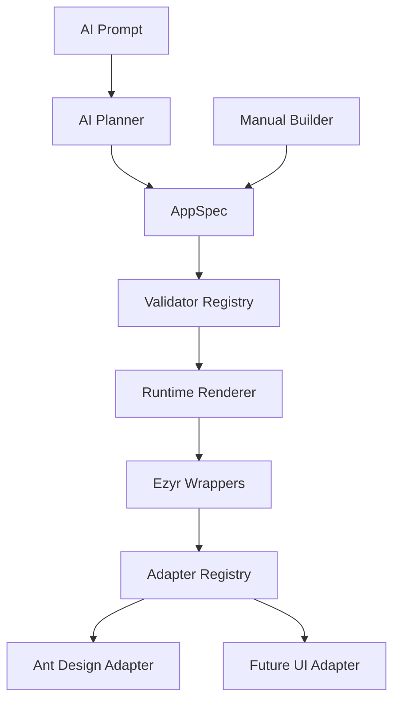
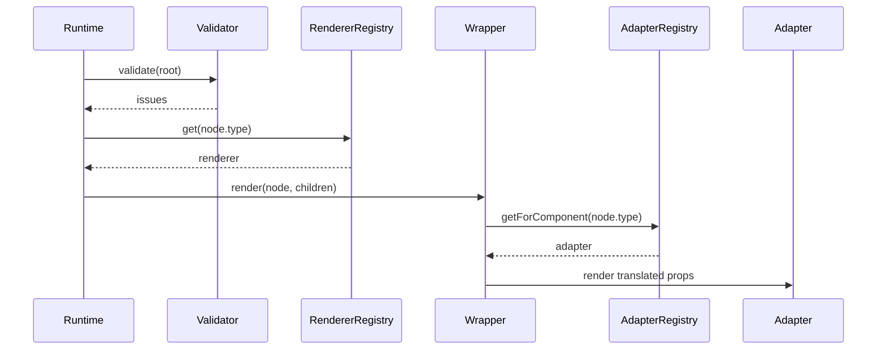
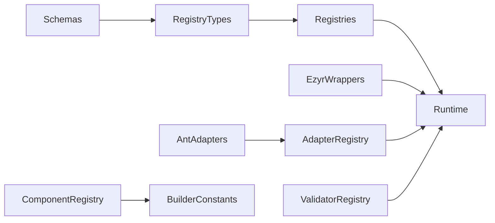
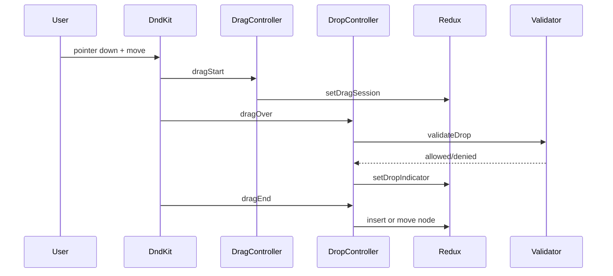

# Ezyr Phase 1 and Phase 2 Engineering Blueprint

Version: 1.0  
Scope: Phase 1 Architecture Specification, Phase 2 Builder Specification, and Implementation Roadmap  
Status: Implementation-ready

## 1. Product Architecture Summary

Ezyr is an AI-first no-code application builder. AI Builder and Manual Builder must produce and edit the same framework-agnostic intermediate representation: `AppSpec`.

The core rule is simple: Builder code edits `AppSpec`; Runtime code renders `AppSpec`; adapter code maps Ezyr wrappers to UI libraries. Ant Design is an implementation detail and must not leak into AppSpec, registry contracts, builder state, or renderer decisions.



## 2. Non-Negotiable Principles

- `AppSpec` is the single source of truth for pages, components, props, styles, bindings, events, and children.
- Builder UI can use Ant Design for editor chrome, but AppSpec runtime components must go through wrappers and adapters.
- No raw Ant Design imports in Ezyr wrappers, runtime renderer, registries, schemas, builder domain logic, validators, or property metadata.
- No component rendering `switch` statements. Use registry lookup.
- Every registry is typed, version-aware, unregisterable, and plugin-ready.
- Properties are metadata-driven. The property panel must not hardcode component-specific controls.
- Manual builder, AI builder, and future exporters must share AppSpec contracts.
- Prefer normalized Redux state for editing and denormalized trees for rendering at boundaries.
- Errors must degrade into visible editor/runtime diagnostics, not blank screens.

## 3. Target Folder Structure

```text
src/
  app/                         Next.js route shell only
  builder/                     Builder public exports and domain helpers
  components/
    adapters/
      ant-design/              Ant Design implementations only
    builder/                   Editor shell UI
    ezyr/                      Framework-neutral wrappers
    layout/                    App-level providers
    ui/                        Generic editor UI primitives
  features/
    assets/
    auth/
    builder/
    projects/
    workflow/
  registry/
    adapter/
    component/
    event/
    icon/
    property/
    renderer/
    template/
    theme/
    asset/
    history/
    selection/
    validator/
    create-registry.ts
    types.ts
  renderer/                    Compatibility facade for node rendering
  runtime/                     AppSpec runtime rendering and adapter bridge
  schemas/                     AppSpec schemas and migrations
  services/
  store/
    api/
    slices/
  hooks/
  lib/
  utils/
  constants/
  types/
plans/
  architect_p_1_2.md
```

## 4. Phase 1 Architecture Specification

### 4.1 Objective

Build the foundation that allows AppSpec to be created, validated, rendered, and extended without coupling to React implementation details or Ant Design. Phase 1 produces the architecture substrate for all builders and exporters.

### 4.2 Phase 1 Responsibilities

Phase 1 owns:

- AppSpec schema and migration hooks.
- Typed registry infrastructure.
- Component metadata registry.
- Renderer registry.
- Adapter registry.
- Ezyr wrappers.
- Runtime recursive renderer.
- Validation pipeline.
- Property, event, icon, template, theme, asset, history, and selection registry contracts.
- Runtime error handling for missing components, renderers, adapters, and invalid schema.

Phase 1 does not own:

- Visual drag-and-drop behavior.
- Canvas editing interactions.
- Workflow execution.
- AI prompt planning.
- Source-code exporters.

### 4.3 AppSpec Schema

AppSpec must remain framework agnostic.

```ts
export type AppNode = {
  readonly id: string;
  readonly type: string;
  readonly props: JsonObject;
  readonly style: JsonObject;
  readonly bindings: Record<string, JsonValue>;
  readonly events: Record<string, JsonValue>;
  readonly children: readonly AppNode[];
};

export type AppPage = {
  readonly id: string;
  readonly name: string;
  readonly path: string;
  readonly root: AppNode;
};

export type AppSpec = {
  readonly schemaVersion: number;
  readonly id: string;
  readonly name: string;
  readonly pages: readonly AppPage[];
  readonly theme: AppTheme;
};
```

Design decision: nodes use generic `props`, `style`, `bindings`, and `events` maps so UI libraries, builder metadata, and exporters can evolve independently. Validation supplies safety at runtime and edit time.

### 4.4 Registry Base Contract

Each registry follows a shared contract:

```ts
export type RegistryEntry = {
  readonly id: string;
};

export interface Registry<TEntry extends RegistryEntry> {
  register(entry: TEntry): void;
  unregister(id: string): void;
  get(id: string): TEntry | undefined;
  has(id: string): boolean;
  list(): readonly TEntry[];
  search(options: RegistrySearchOptions): readonly TEntry[];
}
```

Rules:

- Registries own metadata and lookup. They do not own Redux state.
- Registries must support plugin registration and unregistration.
- Registry entries must be immutable after registration.
- Registry cache invalidation happens when entries are registered, unregistered, or plugin versions change.
- During hot reload, duplicate registration must replace the previous entry by ID.

### 4.5 Registry Responsibilities

#### Component Registry

Owns component metadata:

- `id`
- `displayName`
- `description`
- `category`
- `icon`
- `version`
- `defaultProps`
- `editableProps`
- `events`
- `slots`
- `childrenRules`

Must never own:

- React components.
- Ant Design imports.
- Current selected node.
- Canvas coordinates.

Public APIs:

```ts
componentRegistry.register(definition);
componentRegistry.unregister(componentType);
componentRegistry.get(componentType);
componentRegistry.search({ query, category });
componentRegistry.createNode(componentType, id);
```

#### Renderer Registry

Maps AppSpec component type to an Ezyr wrapper renderer.

```ts
rendererRegistry.register({
  id: "Button",
  render: (node, children) => <EzyrButton node={node}>{children}</EzyrButton>,
});
```

Must never reference Ant Design. Missing renderer produces a visible runtime diagnostic.

#### Adapter Registry

Maps wrapper/component type to provider implementation.

```ts
adapterRegistry.register({
  id: "ant.Button",
  componentType: "Button",
  provider: "ant-design",
  component: AntButtonAdapter,
});
```

This is the only runtime path that may point to Ant Design adapters.

#### Property Registry

Defines property panel controls entirely through metadata.

```ts
type PropertyDefinition = {
  id: string;
  componentType: string;
  label: string;
  editor: "text" | "number" | "boolean" | "select" | "color" | "spacing";
  category: string;
  defaultValue?: JsonValue;
  options?: readonly Option[];
  isVisible?: (node: AppNode) => boolean;
};
```

Must never render property UI directly. It describes what to render.

#### Validator Registry

Runs validation rules:

- Duplicate IDs.
- Unknown component types.
- Missing renderer.
- Missing adapter.
- Invalid parent/child rules.
- Circular references.
- Invalid props.
- Invalid bindings.
- Orphan nodes.
- Schema version mismatch.

Validation must support editor-time validation and runtime preflight.

#### Event Registry

Owns event metadata only:

- Supported events per component.
- Event descriptions.
- Expected payload shape.
- Workflow hook compatibility.

It must not execute workflows in Phase 1 or Phase 2.

#### Template Registry

Stores reusable AppNode or AppSpec fragments. Templates must validate before insertion.

#### Icon Registry

Maps logical icon IDs to icon provider metadata. Component metadata refers to icon IDs, not icon components.

#### Theme Registry

Owns theme token definitions:

- color
- typography
- spacing
- radius
- shadow
- motion
- breakpoints

No hardcoded runtime values should be introduced outside fallback defaults.

#### Asset Registry

Owns asset references and metadata:

- asset ID
- source URL/path
- alt text
- dimensions
- mime type
- usage references

Runtime must handle missing assets with a placeholder diagnostic.

#### History Registry

Defines reversible mutation metadata for undo/redo. The actual history stack lives in Redux.

#### Selection Registry

Defines selection modes and selection constraints. The current selection lives in Redux.

### 4.6 Wrappers and Adapters

Wrappers are framework-neutral component facades:

- `EzyrButton`
- `EzyrInput`
- `EzyrCard`
- `EzyrTable`
- `EzyrImage`
- `EzyrText`
- `EzyrForm`

Wrappers accept `AppNode` and children. They call the adapter bridge.

```ts
export function EzyrButton({ node, children }: EzyrButtonProps) {
  return <RenderAdapter node={node}>{children}</RenderAdapter>;
}
```

Adapters translate AppSpec props into UI library props.

```ts
export function AntButtonAdapter({ node }: ComponentAdapterProps) {
  return <Button type={mapVariant(node.props.variant)}>{text}</Button>;
}
```

Why this exists:

- Builder remains UI-library agnostic.
- Runtime can swap Ant Design for Material UI, Chakra, React Native, or Flutter exporters.
- Component metadata and property definitions remain stable across adapter providers.

### 4.7 Runtime Renderer

Renderer stages:

1. Receive AppSpec.
2. Select page.
3. Validate page root.
4. Recursively render nodes.
5. Look up renderer by `node.type`.
6. Renderer renders wrapper.
7. Wrapper resolves adapter.
8. Adapter renders implementation.



Renderer variants:

- Recursive Renderer: standard tree rendering.
- Layout Renderer: handles layout-aware nodes.
- Slot Renderer: maps named slots to children.
- Conditional Renderer: hides nodes based on visibility expressions.
- Dynamic Renderer: supports lazy component definitions.
- Virtual Renderer: future optimization for large canvases.
- Lazy Renderer: dynamic imports for heavy components.
- Error Boundary: isolates renderer failures per subtree.

### 4.8 Phase 1 Dependency Graph



Allowed dependencies:

- Schemas have no dependency on React, Redux, Ant Design, or Next.js.
- Registries may depend on schemas and registry types.
- Runtime may depend on registries and wrappers.
- Wrappers may depend on runtime adapter bridge.
- Adapters may depend on Ant Design.
- Builder shell may depend on registries, Redux, dnd-kit, and Ant Design editor chrome.

Forbidden dependencies:

- `schemas -> components`
- `registry/component -> antd`
- `components/ezyr -> antd`
- `runtime -> antd`
- `builder domain logic -> antd runtime components`

## 5. Phase 2 Builder Specification

### 5.1 Objective

Build the Manual Builder that edits AppSpec through direct manipulation: sidebar insertion, canvas selection, drag-and-drop, property editing, tree editing, clipboard, undo/redo, zoom, pan, alignment, grouping, and keyboard shortcuts.

### 5.2 Builder Modules

```text
src/features/builder/
  components/
    builder-workspace.tsx
    canvas/
    sidebar/
    toolbar/
    property-panel/
    component-tree/
    overlays/
  dnd/
    drag-controller.ts
    drop-controller.ts
    collision.ts
    insertion.ts
    auto-scroll.ts
  state/
    builder-commands.ts
    selectors.ts
    normalization.ts
  shortcuts/
  clipboard/
  history/
```

Current `src/components/builder/*` can be migrated into `src/features/builder/components/*` when Phase 2 begins. Until then, the public workspace may keep importing from `src/components/builder`.

### 5.3 Builder State Model

Use normalized Redux state for editing:

```ts
type BuilderDocumentState = {
  appId: string;
  activePageId: string;
  nodes: EntityState<NormalizedNode, string>;
  rootNodeIdsByPage: Record<string, string>;
};

type NormalizedNode = {
  id: string;
  type: string;
  parentId: string | null;
  childIds: string[];
  props: JsonObject;
  style: JsonObject;
  bindings: Record<string, JsonValue>;
  events: Record<string, JsonValue>;
};
```

Why normalized state:

- O(1) node lookup.
- Safer move/delete operations.
- Easier undo/redo patches.
- Better memoized selectors.
- Avoids deep tree cloning on every edit.

Render boundary selectors convert normalized state into AppNode trees.

### 5.4 Canvas

Canvas owns:

- Rendering current page AppSpec.
- Selection hit areas.
- Hover outlines.
- Drop indicators.
- Snap guides.
- Grid.
- Zoom.
- Pan.
- Auto-scroll during drag.
- Empty-state placeholders.

Canvas must not own:

- Component metadata.
- Property definitions.
- Persistence.
- Workflow execution.

Canvas rendering should use the same runtime renderer with editor overlays layered above it.

### 5.5 Sidebar

Sidebar reads from Component Registry and Template Registry.

Capabilities:

- Search components.
- Filter by category.
- Drag component definitions.
- Drag templates.
- Show unavailable plugin components as disabled.
- Show component version warnings if a node uses a deprecated definition.

### 5.6 Toolbar

Toolbar owns editor commands:

- Select/insert/preview mode.
- Undo/redo.
- Copy/paste.
- Duplicate.
- Delete.
- Group/ungroup.
- Align left/center/right/top/middle/bottom.
- Distribute.
- Zoom controls.
- Device viewport controls.
- Canvas lock.
- Panel collapse states.

Commands must dispatch typed builder commands. Avoid embedding mutation logic in toolbar components.

### 5.7 Property Panel

Property panel is fully metadata-driven:

1. Read selected node IDs.
2. Resolve component type.
3. Query Property Registry.
4. Group properties by category.
5. Render editor by `editor` type.
6. Validate values with property validators.
7. Dispatch prop/style/binding/event updates.

Supported property categories:

- Identity
- Layout
- Appearance
- Spacing
- Typography
- Responsive
- Accessibility
- State
- Data bindings
- Events
- Permissions
- Visibility
- Localization

Property editor registry should map editor IDs to editor components:

```ts
propertyEditorRegistry.register({
  id: "color",
  component: ColorPropertyEditor,
});
```

Multi-selection:

- Show common properties only.
- Show mixed-value state when selected nodes differ.
- Bulk update compatible properties.

Conditional properties:

- Use `isVisible(node, context)`.
- Never hide data; only hide controls.
- Hidden invalid values still validate.

Responsive properties:

- Store breakpoint overrides in AppSpec style or prop maps.
- UI edits active breakpoint only unless user applies globally.

### 5.8 Drag and Drop

Use dnd-kit for drag mechanics. Builder domain logic must be independent from dnd-kit event shapes.

Drag lifecycle:



Drop validation rules:

- Parent allows child type.
- Child allows parent type.
- Max children not exceeded.
- No cycle introduced.
- Target node exists.
- Target index is within bounds.
- Locked canvas rejects edits.
- Plugin component is installed.
- Schema version is compatible.

Insertion logic:

```ts
type DropIntent = {
  draggedNodeId?: string;
  componentType?: string;
  targetParentId: string;
  targetIndex: number;
  placement: "before" | "after" | "inside";
};
```

Nested drops:

- Compute nearest valid container.
- Prefer deepest valid container under pointer.
- If container is invalid, walk ancestors until a valid parent is found.
- Show explicit denied indicator when no valid target exists.

Auto-scroll:

- Trigger near canvas bounds.
- Cap scroll speed.
- Pause when pointer leaves canvas.
- Keep drop indicator synced after scroll.

Performance:

- Throttle drag-over calculations with `requestAnimationFrame`.
- Cache bounding boxes per drag session.
- Recompute boxes only after scroll, zoom, or tree mutation.
- Avoid dispatching Redux updates for every raw pointer event.

### 5.9 Selection, Clipboard, and History

Selection:

- Single click selects node.
- Shift click toggles selection.
- Drag marquee selects nodes.
- Escape clears selection.
- Selection must survive non-structural prop edits.
- Deleted nodes are removed from selection.

Clipboard:

- Copy selected subtrees.
- Generate new IDs on paste.
- Preserve relative hierarchy.
- Paste into nearest valid selected container.
- Reject invalid pasted children with diagnostics.

History:

- Store command-level patches.
- Merge high-frequency edits such as slider drags.
- Undo after delete must restore subtree and selection where possible.
- Redo must reapply command in deterministic order.

### 5.10 Keyboard Shortcuts

Required shortcuts:

- `Ctrl+Z`: undo
- `Ctrl+Shift+Z` or `Ctrl+Y`: redo
- `Ctrl+C`: copy
- `Ctrl+V`: paste
- `Ctrl+D`: duplicate
- `Delete` / `Backspace`: delete
- `Escape`: clear selection or cancel drag
- Arrow keys: nudge selected nodes where absolute positioning applies
- `Ctrl+A`: select siblings or all nodes based on focus context

Shortcuts must be disabled while typing in inputs unless explicitly handled by an editor.

## 6. Edge Cases

Handle these cases explicitly:

- Duplicate node IDs.
- Unknown component type.
- Missing component registry entry.
- Missing renderer.
- Missing adapter.
- Invalid AppSpec schema.
- Unsupported schema version.
- Deleted selected node.
- Deleted parent with surviving children.
- Orphan children.
- Circular references.
- Invalid nesting.
- Dragging a node into itself.
- Dragging a parent into its descendant.
- Dropping into locked canvas.
- Dropping into maxed-out container.
- Copying nested trees.
- Pasting into incompatible parent.
- Undo after delete.
- Redo after plugin removal.
- Plugin component unregistered while node exists.
- Adapter provider unavailable.
- Theme token missing.
- Asset missing.
- Renderer throws.
- Property editor throws.
- Property metadata references unknown editor.
- Drop target unmounts mid-drag.
- Canvas zoom changes mid-drag.
- Selection lost during schema migration.

## 7. Testing Strategy

Phase 1 tests:

- AppSpec schema parsing.
- Registry register/unregister/get/search.
- Duplicate registration behavior.
- Component `createNode`.
- Renderer missing fallback.
- Adapter missing fallback.
- Validator duplicate ID detection.
- Validator invalid nesting detection.
- Ant adapter prop mapping.

Phase 2 tests:

- Insert component from sidebar.
- Select node on canvas.
- Property panel resolves metadata.
- Prop edits update normalized state.
- Drag new component into valid parent.
- Reject invalid drop.
- Move existing subtree.
- Prevent cycles.
- Copy/paste subtree with new IDs.
- Undo/redo insert, delete, move, prop edit.
- Keyboard shortcuts with input focus guards.
- Multi-selection common property behavior.

Recommended tools:

- Unit tests for registries, validators, reducers, selectors.
- Component tests for property editors and canvas overlays.
- Playwright tests for end-to-end builder workflows.

## 8. Implementation Roadmap

### Milestone 1: AppSpec and Registry Foundation

Tasks:

- Create AppSpec schema.
- Create registry base class.
- Create registry type contracts.
- Add component, renderer, adapter, validator, property, event, icon, template registries.
- Add public barrel exports.

Acceptance criteria:

- AppSpec parser rejects malformed specs.
- All registries support register, unregister, get, has, list, search.
- No Ant Design imports in schemas or registries except adapter registration files.

Codex prompt:

```text
Implement AppSpec schemas and typed registry infrastructure for Ezyr Phase 1.
Keep schemas framework agnostic, add typed registry APIs, and validate with lint/build.
```

### Milestone 2: Wrappers and Adapter Runtime

Tasks:

- Add Ezyr wrappers.
- Add adapter registry.
- Add Ant Design adapters.
- Register adapters in app provider.
- Add missing adapter fallback.

Acceptance criteria:

- Runtime wrappers do not import Ant Design.
- Ant Design imports are isolated to `components/adapters/ant-design`.
- Missing adapter renders visible diagnostic.

Codex prompt:

```text
Create the Ezyr wrapper layer and Ant Design adapter layer.
Wrappers must render through adapter registry and never import Ant Design directly.
```

### Milestone 3: Recursive Runtime Renderer

Tasks:

- Add renderer registry.
- Add recursive AppSpec renderer.
- Add validation preflight.
- Add error fallback for missing renderer and invalid spec.

Acceptance criteria:

- Valid AppSpec renders recursively.
- Unknown component fails visibly.
- Missing renderer fails visibly.
- Build passes.

Codex prompt:

```text
Implement the AppSpec runtime renderer using renderer and adapter registries.
Avoid switch statements and add robust fallback diagnostics.
```

### Milestone 4: Normalized Builder State

Tasks:

- Add normalized node entity state.
- Add selectors to hydrate AppNode tree.
- Add commands for insert, update props, update style, delete, move.
- Add selection slice integration.

Acceptance criteria:

- Tree can hydrate from normalized state.
- Insert/delete/move preserve valid hierarchy.
- Deleted nodes are removed from selection.

Codex prompt:

```text
Implement normalized builder document state with typed commands and selectors.
Do not couple mutations to React components.
```

### Milestone 5: Dynamic Property Panel

Tasks:

- Add property editor registry.
- Add generic property panel renderer.
- Add grouped property sections.
- Add validation messages.
- Add mixed value state for multi-selection.

Acceptance criteria:

- Property panel is generated from metadata.
- No component-specific property hardcoding.
- Prop updates dispatch typed commands.

Codex prompt:

```text
Refactor the property panel to be fully metadata-driven from the property registry.
Implement generic editor resolution, validation display, and prop/style updates.
```

### Milestone 6: Drag and Drop Foundation

Tasks:

- Add dnd controllers.
- Add drag session state.
- Add drop target detection.
- Add drop validation.
- Add insertion indicators.
- Add insert/move commands.

Acceptance criteria:

- Sidebar components can be dropped into valid containers.
- Invalid drops are rejected with visible feedback.
- Moving a subtree cannot create cycles.
- Drop calculations remain smooth during drag.

Codex prompt:

```text
Implement builder drag-and-drop using dnd-kit as an adapter over typed drag/drop domain controllers.
Validate parent/child rules through registry metadata.
```

### Milestone 7: History, Clipboard, and Shortcuts

Tasks:

- Add command history.
- Add undo/redo.
- Add clipboard copy/paste.
- Add duplicate/delete.
- Add keyboard shortcut manager.

Acceptance criteria:

- Undo/redo works for insert, delete, move, and prop edit.
- Copy/paste regenerates IDs.
- Shortcuts do not trigger while typing in inputs.

Codex prompt:

```text
Implement command history, clipboard, duplicate/delete, and keyboard shortcuts for the builder.
Use normalized state and preserve AppSpec validity.
```

### Milestone 8: Canvas Interaction Polish

Tasks:

- Add selection overlays.
- Add hover outlines.
- Add grid, zoom, pan.
- Add snap guides.
- Add context menu.
- Add auto-scroll while dragging.

Acceptance criteria:

- Canvas remains aligned at desktop and mobile viewport sizes.
- Selection and drop overlays match zoom level.
- Auto-scroll keeps indicators stable.

Codex prompt:

```text
Implement robust builder canvas interactions: overlays, zoom, pan, grid, snap guides, context menu, and drag auto-scroll.
Verify visual alignment in browser.
```

## 9. Coding Standards

- Use strict TypeScript.
- Do not use `any`.
- Use readonly types for registry metadata.
- Keep mutation logic in reducers/commands, not components.
- Keep UI-library-specific code inside adapter folders.
- Prefer small pure functions for validation and insertion rules.
- Prefer selectors for derived state.
- Use explicit fallback UI for runtime errors.
- Keep public exports in `index.ts` files.
- Avoid cross-feature imports unless through public exports.

## 10. Anti-Patterns

- Hardcoded property panel per component.
- `switch (node.type)` rendering.
- Ant Design imports in wrappers or registries.
- Deep tree mutation inside React components.
- Storing denormalized AppSpec tree as the only editor state.
- Using array indexes as node identity.
- Silent fallback for missing renderer or adapter.
- Plugin registration with side effects outside explicit register functions.
- Directly using dnd-kit event objects in reducers.
- Mixing selection, history, and document mutations in one reducer.

## 11. Phase Completion Definition

Phase 1 is complete when:

- AppSpec can be validated.
- Component metadata is registry-driven.
- Runtime renders through renderer, wrapper, and adapter layers.
- Ant Design is isolated to adapter/provider/editor chrome.
- Missing registry entries produce diagnostics.
- Lint and build pass.

Phase 2 is complete when:

- Manual builder edits AppSpec through normalized state.
- Canvas supports insert, select, move, delete, copy, paste, undo, redo.
- Property panel is metadata-driven.
- Drag-and-drop validates nesting rules.
- Runtime preview and builder canvas use the same AppSpec renderer path.
- Core workflows are covered by unit and browser tests.
